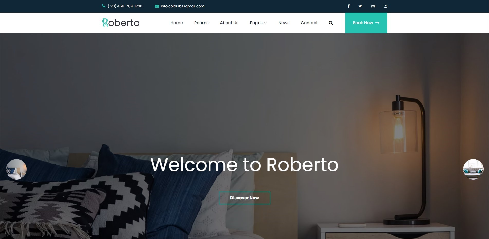
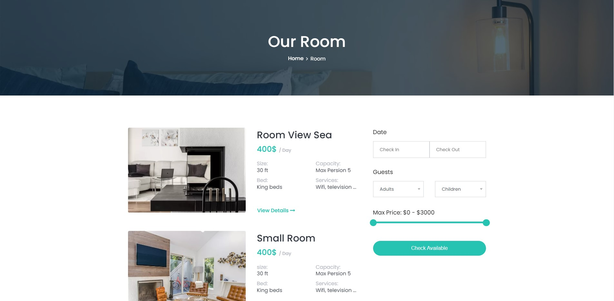
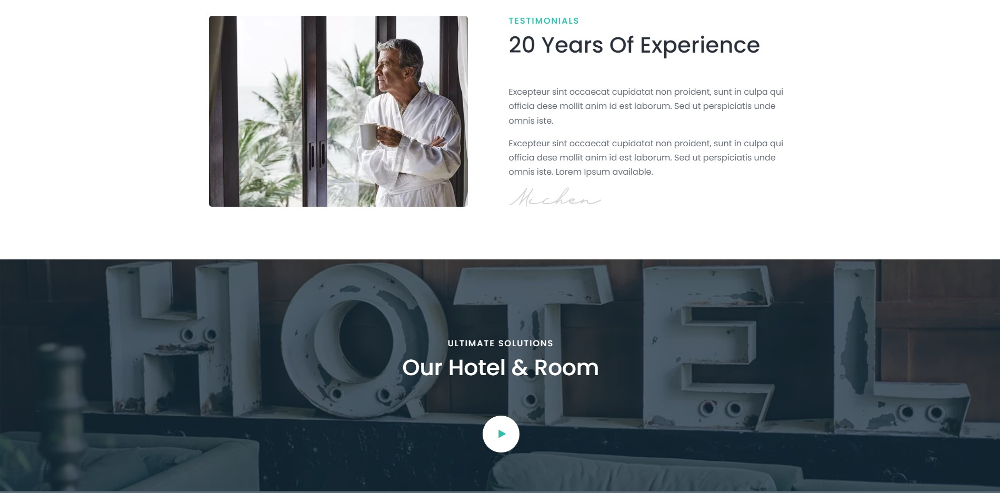
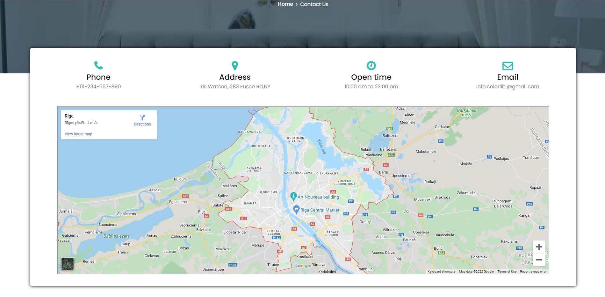

<h1 align="center">Welcome to Roberto 👋</h1>

```
Template for hotel portfolio using vanilla HTML, CSS, and JavaScript
```

### by Abhishek, Prasad and Shubham

<br/>


- This is a basic template for a Hotel group portfolio
- and it was made in 1 week.
- The technologies used are beginner friendly and easy to use.
- If you are interested in contributing to this project feel free to do so.

### 🏠 [Homepage](./Resources/portfolio2.jpg)

### ✨ [Demo](https://roberto-hotel.herokuapp.com/)

## Install

```sh
no installations required
```

## Usage

```sh
just clone it and start using
```

## Dependencies and Tech stack used

1. HTML
1. CSS
1. JavaScript
1. Font Awesome icons library
1. Elegant icons library
   <br/>
   <br/>
# Home


# Rooms


# Testimonials


# Contactus


---

<br/>

## My Portfolio

👤 **Abhishek**

- Website: [abhi-aro.tech](https://abhi-aro.tech/)
- Twitter: [@Prog_Anon](https://twitter.com/Prog_Anon)
- Github: [@PA-iscar](https://github.com/PA-iscar)
- LinkedIn: [@abhi-aro](https://linkedin.com/in/abhi-aro)

## Show your support

Give a ⭐️ if this project helped you!

---
